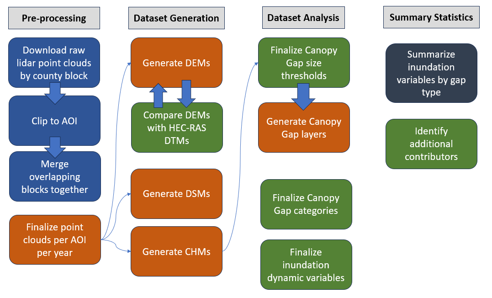

# Inundation Dynamics and Vegetation Structure
*A UMBC masters thesis workspace*
Author: Leah E. Staub

## Elevator Pitch
Forested riparian zones buffer streams and waterways from excessive pollution but are threatened by climate change and human interference. My Research will assess the relationship between inundation dynamics and forest structure by analyzing canopy gap characteristics across three study reaches within the Maryland Piedmont. 

## Key Terms
**Riparian Zone:** The area of interaction between the aquatic and terrestrial environment forms a zone that extends upward and outward from the stream into the overhanging canopy (Swanson et al. 1982)

**Inundation Dynamics:** Maximum water depth(ft), shear stress(lb/sq ft), maximum velocity(ft/s), duration(hrs) when flows overtopped streambanks (Van Appledorn et al., 2019).

**Canopy Gap:**


## Required Datasets
This project requires two major pieces of information: *site specific flood regime and forest structure.* Molly Van Appledorn generated datasets that describe the flow regimes on 4 areas of interest during her PhD and UMBC using the USACE HEC-RAS software. These datasets summarize inundation dynamics for a multitude of flow regimes. Each study area has raw lidar data available that can be used to describe forest structure. Raw lidar point cloud data can be leveraged to generate Digital Elevation Models (DEMs) and Digital Surface Models (DSMs). DEMs and DSMs are the data inputs needed to generate Canopy Height Models (CHMs). CHMs are necessary for this work because they allow Canopy Gaps to be identified in the Area of Interest (AOI). 

### Inundation Metrics
HEC-RAS model information goes here. 

### Lidar


#### Raw lidar data
| **County** | **Year** | **Blocks covering AOI** | **Point Density** | **CRS** | **Source** | 
| ------ | ------ | ------ | ------ | ------ | ------ |
| Montgomery | 2013 | Block 12 | 0.9m | ESRI:103069 | MDiMAP |
| Montgomery | 2018 | Block 2 & 4 | 0.52m | ESRI:103069 | MDiMAP |
| Montgomery | 2020 | Block 2 & 3 | 0.35m | ESRI:103069 | MDiMAP |
| Howard | 2011 | Block 26 | 1.4m | ESRI:103069 | MDiMAP |
| Howard | 2018 | Block 1 & 2 | 0.7m | ESRI:103069 | MDiMAP |
| Baltimore | 2015 | Block 30 & 31 | 0.7m | ESRI:103069 | MDiMAP |
| Harford | 2013 | Block 34 | 1.2m | ESRI:103069 | MDiMAP |
| Harford | 2020 | Block 1 | 0.7m | EPSG:6487 | MDiMAP |


## Methodology



## References


# Developer Guide
This is a guide intended for Gitlab beginners. 

> ***Vocabulary used throughout this guide:***
> ***'Remote' refers to repository hosted online. 'Local' refers to repository on user device. The remote repository is both a back-up for workflows in case something happens to the user's local device and a platform for project visibility and contribution throughout the USGS.***

## SSH Setup 
*Ensure gitbash and miniconda3 are installed and connected to each other on device* 

> ***Must be on VPN for SSH to work with usgs gitlab.***

### Check for ssh keys on device
```
ls -al ~/.ssh
```
If none are listed, [a new key must be created](https://docs.github.com/en/authentication/connecting-to-github-with-ssh/adding-a-new-ssh-key-to-your-github-account).

If there are keys existing, it needs to be confirmed that it is listed in the users gitlab SSH keys library. This can be done by navigating to the .ssh folder on the device, copying the public ssh key contents, and pasting into a new SSH key in the users gitlab profile. This process is described in more detail [here](https://phoenixnap.com/kb/git-clone-ssh).

### Ensure the SSH key is added to the SSH agent
Check to see if gitbash is connected to gitlab: 
```
ssh -T git@github.com
```
Check to see if ssh agent is running:
```
eval "$(ssh-agent -s)"
```
Add private ssh key on device to ssh agent
```
ssh-add <insert/path/to/private/key>
```

## Clone repository and start contributing! 
Navigate to desired area for repository to be cloned to.
```
git clone https://github.com/lstaub4/gap_inundation.git
```
Repository familiarization. Navigate to the repository using *cd* and list all folders within using *ls*.
```
cd gap_inundation
ls
```

### Make your own branch 
Name the new branch to reflect current task or issue at hand. 
```
git branch <name-of-branch>
```
Switch to this branch: 
```
git checkout <name-of-branch>
```

Start making changes, contributions, and adding workflows! 

## Push Contributions to repository
It is wise to frequently push your edits from the local branch to the remote branch to ensure our work is backed up. Many of these steps are described [here](https://www.earthdatascience.org/workshops/intro-version-control-git/basic-git-commands/). 


> ***Must be on VPN for push requests to work.***

Check the difference between your local branch and your remote branch: 
```
git status
```
Add all contributions to log:
```
git add --all
```
Leave a commit message to go along with contributions. Be as detailed as possible!
```
git commit -m "<message inserted here>" 
```
Check if this commit was added, adding the 5 will list last 5 commits. Leaving the 5 off will print the entire history, beware~
```
git log -n 5
```

Push local branch to remote branch to ensure workflow is backed up online!
```
git push origin <name-of-branch>
```

## Merge Branch to Main
Once the task or issue at hand has been completed or solved, the branch created can be merged into the main stem. Ensure that all commits have been completed and that the main branch on local machine is up to date with remote main branch. 

Check the difference between the local branch and the remote branch: 
```
git remote update
git status
```
If there is no difference, it is okay to merge. If there is a difference, there could be a handful of causes: 
1. Local branch is ahead of the remote branch.
    - go through git add, commit, and push process of local branch. 
2. Local branch is behind the remote branch. This could happen if another team member has contributed to the same branch. 
    - pull updates
    ```
    git pull  
    ```
If changes are made to the main branch that should be incorporated before branch task is finished, the main branch must be pulled and merged into desired branch. 
```
git checkout main 
git pull
```
This will update the local main branch to reflect the remote main branch. To add changes from updated main branch into the working branch: 
```
git checkout <name-of-branch>
git merge main
```

Once the working branch is ready, it can be merged into the main branch. This can be done by completing the add, commit, push combination and then going to the repository on Gitlab. From there, navigate to the desired branch using the drop down and select the "create merge requuest" button that will display in a banner on the top of the screen. 

The merge request will need to be approved and submitted- all developers on this project should have permission to do both. Once the merge of the desired branch into main is completed, the desired branch will be deleted remotely on Gitlab. It is best practice to also go into gitbash and also delete the now complete branch:
```
git checkout main
git branch -d <name-of-branch>
```

It is best practice to ensure that the local main branch is up to date before creating a new branch. This can be accomplished by performing the "git pull" command. 

